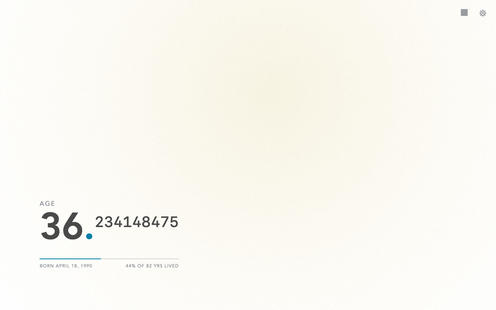
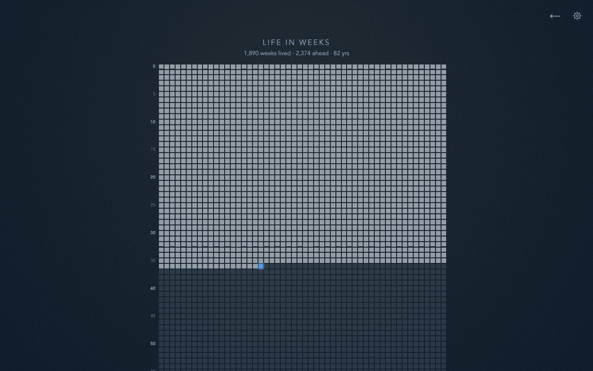

<div align="center">
  
  <h1>Mortality</h1>
  <p>
    Your age, counting up live on every new tab.<br />
    A quiet, recurring reminder that time is passing.
  </p>
  <p><a href="https://alphabt.github.io/mortality/"><strong>Try Mortality online</strong></a></p>
</div>

<p align="center">
  <a href="#install">Install</a> ·
  <a href="#privacy">Privacy</a> ·
  <a href="#languages">Languages</a> ·
  <a href="#development">Development</a> ·
  <a href="#support">Support</a>
</p>



<p align="center"><em>One live reading, its context, and room to breathe.</em></p>

## Install

Choose your browser. The store versions replace the new tab page; the
[online demo](https://alphabt.github.io/mortality/) runs as an ordinary web page.

<p align="center">
  <a href="https://chromewebstore.google.com/detail/mortality/dmcopoldcoemapdejndbdnfmbofbkmbh"></a>
  &ensp;<wbr />&ensp;
  <a href="https://microsoftedge.microsoft.com/addons/detail/dljbhjjkfdabmfijhmcoodklndhminom"></a>
  &ensp;<wbr />&ensp;
  <a href="https://addons.mozilla.org/firefox/addon/mortality/"></a>
</p>

Demo settings stay in this browser's local storage. Only the installed extension
becomes your new tab page.

## One number, several perspectives

Mortality starts with fractional age, ticking in real time. Switch to calendar
age, a live next-birthday countdown, days or weeks lived, estimated time left,
lifetime progress, or a life-in-weeks view.

- **Estimates, not predictions.** Remaining-life views condition expected
  lifespan on your current age, using an explicitly selected World (UN 2023) or
  United States (SSA 2023) baseline. You can also set a custom life expectancy.
- **Personal, not busy.** Follow the system light or dark theme, choose a
  contrast-checked preset, set custom colors, change the numeral style, or add a
  quiet reflection line beneath the counter.
- **Accessible by design.** Mortality supports keyboard use and screen readers,
  meets WCAG 2.1 AA, and provides a `prefers-reduced-motion` path.



<p align="center"><em>Life in weeks shows lived time, the present week, and what may remain.</em></p>

## Privacy

Mortality requests only the browser's `storage` permission. Birth details and
preferences stay in extension-local storage unless you explicitly enable
browser-account sync.

- **No Mortality account or app backend.** There are no analytics or ads, and
  the developer cannot access your settings.
- **Sync is optional and scoped.** One opt-in syncs your theme, counter mode,
  numeral style, reflection setting, and language. A second can also sync your
  birth date and time, birth time zone, sex at birth, and selected
  life-expectancy source or custom years through your browser vendor's sync
  service.
- **You keep control.** The
  [privacy policy](https://alphabt.github.io/mortality/privacy.html) explains
  data controls, export and import, and how to remove synced data.

## Languages

Mortality follows the browser or operating-system locale by default and falls
back to English. You can choose another language during setup or under
**Settings → Display**. It ships all 55
[Chrome-supported extension locales](https://developer.chrome.com/docs/extensions/reference/api/i18n#locales).

<details>
<summary>View all 55 locale codes</summary>

<p>
  <code>ar</code>, <code>am</code>, <code>bg</code>, <code>bn</code>,
  <code>ca</code>, <code>cs</code>, <code>da</code>, <code>de</code>,
  <code>el</code>, <code>en</code>, <code>en_AU</code>, <code>en_GB</code>,
  <code>en_US</code>, <code>es</code>, <code>es_419</code>, <code>et</code>,
  <code>fa</code>, <code>fi</code>, <code>fil</code>, <code>fr</code>,
  <code>gu</code>, <code>he</code>, <code>hi</code>, <code>hr</code>,
  <code>hu</code>, <code>id</code>, <code>it</code>, <code>ja</code>,
  <code>kn</code>, <code>ko</code>, <code>lt</code>, <code>lv</code>,
  <code>ml</code>, <code>mr</code>, <code>ms</code>, <code>nl</code>,
  <code>no</code>, <code>pl</code>, <code>pt_BR</code>, <code>pt_PT</code>,
  <code>ro</code>, <code>ru</code>, <code>sk</code>, <code>sl</code>,
  <code>sr</code>, <code>sv</code>, <code>sw</code>, <code>ta</code>,
  <code>te</code>, <code>th</code>, <code>tr</code>, <code>uk</code>,
  <code>vi</code>, <code>zh_CN</code>, and <code>zh_TW</code>.
</p>

</details>

---

## Development

The shipped extension has **no build step and no runtime dependencies**. The
files in [`src/`](src/) _are_ the extension; npm tooling is for development only,
and `npm run zip` packages only `src/`.

### Start the preview

Install the development dependencies once, then start the local preview:

```sh
npm install
npm run dev
```

In the Copilot app, **Run** does the same thing and opens the preview in the
integrated browser. It starts at `http://127.0.0.1:4173/`, chooses the next
available port when needed, and uses the same local-storage fallback as an
ordinary HTTP preview.

### Load the extension

Use a real browser to test new-tab behavior:

- **Chrome / Edge:** open `chrome://extensions`, enable _Developer mode_, select
  _Load unpacked_, and choose the `src/` folder.
- **Firefox:** open `about:debugging` → _This Firefox_ → _Load Temporary Add-on_
  and choose `src/manifest.json`.

Edit a file, then reload the extension to see the change.

### Check and package

| Task                        | Command                 |
| --------------------------- | ----------------------- |
| Check formatting            | `npm run format:check`  |
| Run the Vitest suite        | `npm test`              |
| Re-run tests on change      | `npm run test:watch`    |
| Generate a coverage report  | `npm run test:coverage` |
| Run the Chromium smoke test | `npm run test:chromium` |
| Package the extension       | `npm run zip`           |

Vitest runs against jsdom, covering storage and theming, view renderers, and the
full setup → counter → settings flow. Before the real-browser smoke test, install
Playwright's pinned Chromium once:

```sh
npx playwright install chromium
npm run test:chromium
```

Packaging produces `artifacts/mortality-v<version>.zip`, with the version read
from `src/manifest.json`. CI checks formatting, Vitest, the Chromium extension
smoke test, and packaging on every pull request through the
[`ci`](.github/workflows/ci.yml) workflow.

### Release and publish

Pushing a `v*` tag runs the [`release`](.github/workflows/release.yml) workflow.
It reuses the CI gate, packages the extension once, publishes a GitHub Release,
and submits that exact asset to the Chrome, Edge, and Firefox stores using
scoped store API keys held in repository secrets, never an interactive store
login.

Manual or subset publishes use
[`publish-stores`](.github/workflows/publish-stores.yml). Setup, required
secrets, and manual runs are documented in the
[publish-to-stores skill](.github/skills/publish-to-stores/SKILL.md).

## Support

For bugs, questions, or privacy support, open an issue in the
[public Mortality support tracker](https://github.com/alphabt/mortality/issues).
Issues are public, so do not include your birthday or other personal information.

## License

Mortality is available under the [MIT License](LICENSE) © alphabt.
